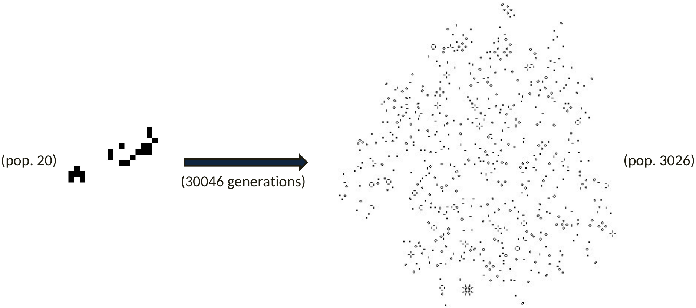
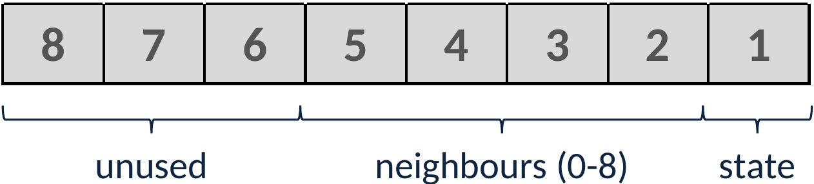

# Optimised Conway's Game of Life

This project is a heavily optimised C++ implementation of the classic [Game of Life](https://en.wikipedia.org/wiki/Conway%27s_Game_of_Life)
using the default 23/3 ruleset. It outperforms naive approaches to the problem by an approximate
factor of 66, still leaving some room for further speed-ups. It was developed as an algorithm
engineering class project, with considerable inspiration taken from Michael Abrash's legendary
[Graphics Programming Black Book](https://web.archive.org/web/20190706123029/http://www.drdobbs.com/parallel/graphics-programming-black-book/184404919).
Graphics output is done using the [FLTK library](https://www.fltk.org/).

As a project focused on algorithmic optimisation, it features a facility to benchmark the algorithm
on custom patterns, storing the averaged computation time in a CSV file for further analysis.
Patterns may be provided in [RLE format](https://www.conwaylife.com/wiki/Run_Length_Encoded).
A few sample patterns, downloaded from [LifeWiki](https://conwaylife.com/wiki), are provided with
this project.


## But Why *Another* Game of Life?

I get it – Conway's Game of Life is *the* stereotype project any aspiring hacker probably attempted
to implement at least once in their life.

However, almost all of these implementations have *very poor* optimisation, never moving beyond
a quite simplistic approach:

1. Loop over the entire field.
2. For each cell, look at its *eight*\* neighbours, counting the number of living cells (\*you have
   to account for special cases like the edges of the field, and handle them appropriately).
3. Apply the rules to decide the cell state in the next round:
    * A *dead* cell with three neighbours *comes alive*.
    * A *living* cell with two or three neighbours *stays alive*.
    * A *living* cell with one or zero neighbours *dies* from loneliness.
    * A *living* cell with four or more neighbours *dies* from overpopulation.

It's only natural to want to write the algorithm that way: It derives from the game's description
directly – in the same way that a recursive implementation of the Fibonacci algorithm manifests
naturally when looking at the mathematical definition.

However – just like the Fibonacci algorithm – this naive approach is highly wasteful and
inefficient. Yet still – *unlike that Fibonacci algorithm* – it stays mostly unquestioned within the
programming community, getting repeated in the same fashion across generations of developers.
Sometimes, it even happens to seep into projects *aimed at speeding up the calculation*: For
instance, when I looked for related projects, I discovered a version of the algorithm modified to
run in highly parallel computing environments (that is, HPC clusters). Curiously, though, upon
taking a closer look, I discovered that even this version used the very same wasteful
neighbour-counting algorithm at its core. It was a baffling discovery: Instead of taking a step
back, taking a look at the algorithm itself first, they skipped straight to "let's throw more
computing power at it". It felt like putting a racing car engine into a tractor. Remarkably, judging
from the numbers presented, their version, executed on an actual HPC cluster, performed *much* worse
than the implementation provided in this repository, which is optimised to run on simple,
consumer-grade CPUs at home.

So let me take you on a journey into the deep intricacies of Conway's Game of Life, as you might
have never experienced before. In the following sections, I will walk you through each version of
the algorithm, outlining the optimisation steps in greater detail, giving you the raw benchmark
results along with both the relative and absolute speed-up factor. In the end, as lined out in the
introduction, we will arrive at a version operating **66 times** faster than our initial algorithm,
with still ample headroom left to make it even faster.

Let's begin!


## Optimisation Steps in Detail
### The Basics: Implementation Choices and Benchmarking Methodology

In its pure version, Conway's Game of Life takes place on a grid of infinite size. As you might be
aware, our technological capabilities are currently not *quite* there, so we have to make
a tradeoff. A common choice is to limit the grid size to a chosen number and consider any cells
beyond that limit dead. However, for this project, we try something different: a *toroidal* array,
that is, an array wrapping around its edges: If you, for instance, go beyond the right edge, you
come out at left side again (just like Pacman). This allows us to simulate something closely
resembling infinity, with the unfortunate downside of certain patterns developing slightly different
than shown on Life-related sites, which usually assume a fixed-size grid. But don't worry – all
optimisations work perfectly on a "standard" field as well.

As for the benchmarks, certain basic parameters have to be chosen in order to gain realistic,
high-quality, comparable results. Namely, these are:

* the size of our field,
* how many generations, and
* the starting pattern

For our benchmark, we choose a field of 500x500 cells size, which is sufficiently large even for
complex patterns, and gives our CPU a plenty amount of cells (250.000) to churn on.

As for our initial pattern, we use the [*Eve*](https://conwaylife.com/wiki/Eve) pattern.
Eve is a *methuselah* with outstanding longevity: Starting simple, it continues to grow for an
impressive 30.046 generations before finally reaching its stable state:



Benchmarking on the Eve pattern gives us numerous advantages: Its slow and steady development allows
us to run the benchmark for a long time, giving us more accurate results, while also allowing us to
observe the algorithm across a multitude of conditions, i.e., mostly empty to more crowded fields.
Conveniently, we choose 30.000 for the number of generations to run our benchmark.

For optimal performance, graphics output is disabled during the benchmark. The benchmarking
algorithm continually evolves the field, taking the *wall clock time* at the beginning and end of
each iteration. This gives us the run time for each generation. Run times are summed up and averaged
over 50 generations each, also calculating a *generations per second* (GPS) value. The average run
times and GPS values are written to a CSV file, along with the generation at which they were
determined. The average of all GPS values is used to compare the versions of the algorithm against
each other.

To achieve maximum speed, the program is compiled with the highest optimisation level, `-Ofast`.
We also set `-march=native` to enable the use of any potential capability of the host system's
particular CPU model (though its impact is often negligible). The benchmarking results presented in
the following sections were taken on a *Framework Laptop 13* equipped with an *AMD Ryzen 7 7840U*
CPU, running *Fedora Kinoite 41* with all other applications closed and the CPU governor set to
*performance*.


### The Starting Point: Our First Version

Our first version basically follows the algorithm as outlined in the introduction. It resembles most
implementations you would commonly encounter in the wild, not being particularly special in any way.
This is a good point to outline some technical details, so we can get a better understanding of the
program's inner workings and have a clearer picture on how and why our subsequent optimisations
improve the execution speed.

First, let's take a look at what is required to make the Game of Life algorithm work:

1. A *data type* suitable for storing the state of a cell in the field.
2. A *data structure* suitable for keeping the two-dimenisonal field's state in our chosen type,
   allowing random access and modification at any index. Needs to be allocated on the heap, unless
   we hard-code the dimensions of our field.
3. Of that data structure, we need to have *two*: One holding the field's *current* state, and
   a second one storing the *next state*, i.e. the state of the following generation. For this
   project, we choose to call them *front field* and *back field*, in resemblance of
   double-buffering techniques used in game development.
4. Some logic iterating over our front field, determining the alive neighbours of each cell,
   applying the game's rules, writing the result to the back field, flipping both fields at the end
   of the process.
5. Benchmarking code to measure the timing of said logic, printing performance data into a file.
6. Some way to put the game's current state on the screen.

With these requirements known, here is how each of them is implemented for our first, naive
algorithm:

1. In our first version, we use `bool` for storing a cell's state. As a cell can only ever be in two
   states (alive/dead), this seems the natural choice. This will change later.
2. For storing large amounts of data, an array is probably the first structure to come to mind.
   Since dealing with "raw" arrays in C++ can be annoying, we choose `std::vector<bool>` instead for
   added convenience (which is not quite optimal, as we will see later). Even though our field has
   two dimensions, we avoid nesting vectors by allocating only a single, *one-dimensional vector* of
   `width*height` length, keeping the number of rows and columns separately. For a given cell in the
   field specified by `x` and `y` coordinates, we calculate the corresponding location in our vector
   with `(y * width) + x`. To handle all this transparently, we implement a `SimpleMatrix` class
   with an `operator()` taking `x` and `y` as arguments.
   (By the way: Why do we use a `std::vector` if the size of our field isn't going to change beyond
   initial allocation? After all, the overhead of using a dynamic container type seems wasteful if
   we're not going to need it. The answer is quite simple: *Because it doesn't matter.* Internally,
   indexing a `std::vector` is exactly the same as indexing a raw pointer or a `std::array`. You
   can verify this easily by looking at the resulting assembly code. So it's mostly a matter of
   taste.)
3. Both of our fields are kept in a `GameField` class. Besides holding the two fields and the
   field's size, this class is also responsible for determining the next state of the field (i.e.,
   the game's logic), keeping track of the current generation number.
4. Counting the neighbours and setting each cell's next state is done using the simple approach,
   splitting the logic into multiple methods:
   ```cpp
   bool GameField::getElementAt(int row, int column) const {
       if (row < 0) row = getRows() - 1;
       if (row >= getRows()) row = 0;
       if (column < 0) column = getColumns() - 1;
       if (column >= getColumns()) column = 0;
       return frontField(row, column);
   }

   int GameField::neighborCount(int row, int column) const {
       int sum = 0;
       for (int y = row - 1; y <= row + 1; y++) {
           for (int x = column - 1; x <= column + 1; x++) {
               sum += getElementAt(y, x);
           }
       }
       return sum - getElementAt(row, column);
   }

   bool GameField::nextCellState(int row, int column) const {
       int neighbors = neighborCount(row, column);
       bool isAlive = getElementAt(row, column);
       return (!isAlive && neighbors == 3) || (isAlive && (neighbors == 2 || neighbors == 3));
   }


   int GameField::nextGeneration() {
       for (int i = 0; i < getRows(); i++) {
           for (int j = 0; j < getColumns(); j++) {
               bool nextState = nextCellState(i, j);
               backField.setElementAt(i, j, nextState);
           }
       }
       auto tempField = frontField;
       frontField = backField;
       backField = tempField;

       return ++current_gen;
   }
   ```
   To count a cell's neighbours, we simply use two nested `for` loops to sum up *all* surrounding
   cells including the cell itself, then undo the superfluous addition by subtracting the cell's
   value from the result. This saves us from having to write out each cell access separately. (In
   case you're wondering: The GCC compiler is actually smart enough to figure this out when using
   the highest optimization level.) Getting each cell's state is handled by the `getElementAt`
   method, which also handles the wrapping around the field's edges for us. 
5. For performance measurements, we make use of [OpenMP](https://www.openmp.org/), a parallel
   programming specification and library which we're going use more at later optimisation stages.
   OpenMP provides us a handy function, `omp_get_wtime()`, returning the current *wall clock time*
   in seconds. Wrapping our `nextGeneration()` in two calls gives us the computing time of a single
   generation:
   ```cpp
   auto start_time = omp_get_wtime();
   field.nextGeneration();
   auto run_time = omp_get_wtime() - start_time;
   ```
   As stated before, these run times are accumulated over a (configurable) total of 50 generations,
   then written out into a CSV file along with the GPS value (which is just `1.0 / avg`). All that
   functionality is kept in another class, `FieldBenchmark`, which also handles opening and
   finalising the output file, and printing a simple progress bar.
   The resulting CSV file can be loaded with a data analysis framework of your choice, but if we
   just need the average GPS value of the entire benchmark, AWK is more than sufficient:
   ```
   $ awk -F ',' '{ total += $3 } END {print total/NR}' benchmark_500x500.csv
   ```
6. Graphics output is quite simple. All we need to do is draw a bunch of colored boxes on a black
   background – no bells and whistles. We choose the FLTK framework avoid having to pull in an overly
   complex UI library. Though a bit arcane by today's standards, it gets the job done nicely in as
   little as 66 lines of code. As a nice little addition, pressing the space bar allows us to
   start/stop the game anytime.

So, how does our initial implementation fare? Using the setup described, we come out at an average
of **339 g/s**. That's 84.750.000 cells processed in one second. Doesn't seem too bad!

For easy comparison, we are going to line up our results along with their relative and absolute
speed-up values from now on:

| Version           | Naive |
|-------------------|-------|
| Performance (g/s) | 339   |
| rel. speed-up     | 1.0   |
| abs. speed-up     | 1.0   |


There is an important thing to note here: While we consider this version our base (or "naive")
version, it isn't actually as bad as it could potentially be. In fact, it already already features
a few (albeit not perfect) basic optimisations which are common sense for developers with a basic
knowledge of optimisation: For starters, it's written in C++, a compiled language with lots of
low-level control and a smart compiler. That alone gives us a speed boost of about 25x if
compared to Python. What's more, the contents of the field are stored in *one* contiguous
array, gaining us good *data locality*, resulting in a cache-friendly behaviour. This is not a given
– an overzealous juniour developer may be tempted to employ disadvantageous "best practices" and
define something like `BoolCell : Cell<bool>`, having data encapsulation and accessor functions to
read or modify the state, then storing it in nested vectors. This would result in worse data
locality while also adding the overhead calling instance methods. And if they were to include more
members (e.g., x/y coordinates), or if vital methods were virtual in the base class, or if each
cell were even allocated individually, then all bets would be off.

But I digress. Let's move on and see where we can do better with our version.


### Optimisation 1: Using a Better Data Type

To move on, I need you to recognise a common pitfall when dealing with boolean values in C++:
**`std::vector<bool>`** is not quite what you expect it to be. While it would probably be obvious to
more experienced C++ programmers, it's not something you would expect naturally without reading the
[reference on this topic](https://en.cppreference.com/w/cpp/container/vector_bool.html).
But let's conduct a little experiment to see what happens. Here are two (arguably contrived)
functions returning an element in a vector at a given index:

```cpp
int index_of(std::vector<int> &vec, int i) {
    return vec[i];
}

bool index_of(std::vector<bool> &vec, int i) {
    return vec[i];
}
```

This is the resulting assembly from compiling these almost identical functions (using GCC,
with optimisation enabled):
```asm
index_of(std::vector<int, std::allocator<int>>&, int):
    mov     rax, QWORD PTR [rdi]
    movsx   rsi, esi
    mov     eax, DWORD PTR [rax+rsi*4]
    ret

index_of(std::vector<bool, std::allocator<bool>>&, int):
    mov     rdi, QWORD PTR [rdi]
    movsx   rdx, esi
    mov     ecx, esi
    mov     eax, 1
    shr     rdx, 6
    sal     rax, cl
    and     rax, QWORD PTR [rdi+rdx*8]
    setne   al
    ret
```

The boolean version is more than twice as long! Instead of just returning the value found at the
given offset in the vector, it involves a substancial amount of bit manipulation. Here is the truth:
**`std::vector<bool>` is a special case** (and quite a controversial one, mind you). Instead of
giving each of its elements its own memory address, it packs them together such that each values
takes only one bit of storage. While beneficial if you were handling an enormous amount of boolean
values and care about memory, this is also detrimental to performance.

Let's see how much better we can do by exchanging our underlying data type. In C-like languages,
booleans are sort of an illusion anyway – any primitive type which can be zero or non-zero (i.e.,
all of them) would do just as well. We could use `unsigned char`, for instance. But wait: Actually,
there's a performance difference between other types as well! Depending on their size, a CPU can
handle certain types a little better than others, which can easily make speed difference of 10-20%.
Specifically, each CPU has a "native" type which it can handle best. Usually, this is the unsigned
type of the processor's default integer size (which is 64 bits on modern hardware). But we don't
have to make educated guesses – instead, we can leave that choice to our compiler: Since C++11, the
standard includes [fixed width integer types](https://en.cppreference.com/w/cpp/types/integer.html),
of which the "fastest" types are particularly interesting. For this project, we can use the
(horribly inconsistently named) `uint_fast8_t` and be guaranteed to have the fastest type on our own
system. All that is left is to change our logic a bit: `true` becomes 1, `false` becomes 0.

This is the result:

| Version           | Naive | uint_fast8_t |
|-------------------|-------|--------------|
| Performance (g/s) | 339   | 1241         |
| rel. speed-up     | 1.0   | 3.66         |
| abs. speed-up     | 1.0   | 3.66         |

Boom. That's a 366% increase in speed, just by swapping out the underlying data type. Definitely one
of the biggest returns of investment in this project. Let's move on!


### Optimisation 2: Adding Padding to the Field

Now would be the time to open the profiler to see where we have potential for further optimisation.
What you would see is something like this: *62% of all execution time is spent in the `getElementAt`
method*.

Why is that? Well, for each call, our method has to check whether one of our current indices is at
one of the four edges of our field, and adjust accordingly. That's *four* ifs for each single call.
Given that we are counting eight neighbours for each of our 30.000 cells in the field, that's
*960.000* conditions checked in each generation. How wasteful!

The solution is simple: We can add *padding* to our field. On each edge on the field, we add another
row or column mirroring the opposing side. Once a generation is completed, we move along each edge
and copy the contents into the corresponding padding on the other side, which costs us almost no
time. Now we can eliminate all the conditionals from our `getElementAt` method – if we are at one of
the edges, we simply read the value from the padding. (By the way: This idea was originally taken
from the book, and is explained in more detail there.)

How much performance gain does it get us?

| Version           | Naive | uint_fast8_t | Padding |
|-------------------|-------|--------------|---------|
| Performance (g/s) | 339   | 1241         | 1543    |
| rel. speed-up     | 1.0   | 3.66         | 1.24    |
| abs. speed-up     | 1.0   | 3.66         | 4.55    |

That's a formidable 24% gain in performance. Why not more? Well, your CPU does a tremendously good
job at [predicting the branches](https://en.wikipedia.org/wiki/Branch_predictor) for our
conditionals, keeping the computational costs low. Thanks!


### Optimisation 3: Removing Abstractions

In the next step, we remove some of the superfluous classes. As you can see, a lot of the program's
logic was hidden behind classes: We used `getElementAt` in our `GameField` to access each cell's
state, which would in return call the overloaded index operator of our `SimpleMatrix` class. Oh, and
did I mention that `getElementAt` is called by `neighborCount`, which is called by `nextCellState`,
which is called by `nextGeneration`?
Wow. That seems a bit... excessive. While these OO practices result (in theory) in cleaner, reusable
code, they can be a hindrance when doing optimisation: All these method calls add a certain overhead,
slowing down the computation. That's why we do away with them now: Specifically, we get rid of
`SimpleMatrix` completely, storing our vectors in `GameField` directly. For faster access, we also
define some new inlined "accessor" functions, and change our code accordingly:
```cpp
inline uint_fast8_t get(const std::vector<uint_fast8_t> &vec, int width, int y, int x) {
    return vec[(y * width) + x];
}

inline uint_fast8_t get_padded(const std::vector<uint_fast8_t> &vec, int width, int y, int x) {
    return get(vec, width + 2, y + 1, x + 1);
}

inline void set(std::vector<uint_fast8_t> &vec, int width, int y, int x, uint_fast8_t value) {
    vec[(y * width) + x] = value;
}

inline void set_padded(std::vector<uint_fast8_t> &vec, int width, int y, int x, uint_fast8_t value) {
    set(vec, width + 2, y + 1, x + 1, value);
}
```

While we are at it, we also do away with a few more unnecessary method calls, for instance `getRows`
and `getColumns`. This is the result:

| Version           | Naive | uint_fast8_t | Padding | OO-- |
|-------------------|-------|--------------|---------|------|
| Performance (g/s) | 339   | 1241         | 1543    | 1665 |
| rel. speed-up     | 1.0   | 3.66         | 1.24    | 1.08 |
| abs. speed-up     | 1.0   | 3.66         | 4.55    | 4.91 |

Not too much, but we take it. We're almost five times faster now!


### Optimisation 4: Changing the Approach

Now we're getting to our most significant optimisation so for. But before we start, I would like to
make clear that I do not claim any ownership of the idea: It was originally described in the book
and can be read in more detail there.

So let's take a look at our algorithm. There's a lot of labour involved in having to count all the
neighbours, each time. What if... we could just stop doing that? Instead of looking at each cell's
direct neighbour, maybe we could employ some sort of *magic crystal ball* just telling us the amount
of living neighbours to each cell, *without* having to count them manually? Obviously, such a thing
does not exist (as opposed to Python, where you'd probably just `import crystalball`). But we can
get close!

You see, since we are using unsigned integer values for keeping our cell state, we have some free
bits left in each cell. We could put them to good use and change the encoding a little bit:



Now, each cell can not just store its own state, but keep track of its neighbours as well!
Each time a cell's state changes, we simply propagate that change to its neighbours. To make this
work, we need to change the program's logic quite a bit:

1. Reading a cell's state is a bitwise AND of the value and 1:
   `get(frontField, columns, row, column) & 1u`.
2. Enabling a cell is a bitwise OR of the value and 1 (`get_mutable` is a newly introduced accessor
   returning a mutable reference to a cell in the field):
   `get_mutable(backField, columns, row, column) |= 1u`, followed by a propagation to its
   neighbours.
3. Disabling a cell is a bitwise AND with of the value and a bitwise "NOT 1":
   `get_mutable(backField, columns, row, column) &= ~1u`, again followed by propagation.
4. "Counting" the neighbours of a cell is done by shifting the value one bit to the right:
   `get(frontField, columns, row, column) > 1u`.
5. Increasing the neighbour count of a cell is done by adding *2* (1 shifted one bit to the left)
   to its value.

This works well for two major reasons:

1. We can stop counting each cell's eight neighbours, extracting the number directly instead. In
   lieu of counting, we propagate *only* when a cell's state has changed. This is much less work
   than processing each cell individually, unconditionally.
2. At any given point in time, the larger proportion of our field will just be empty space. A dead
   cell with no living neighbours is destined to stay dead in the next generation. Our new encoding
   allows us to identify such cases immediately: We can skip any cell with a value of zero
   altogether!

(On a side note: Since this is basically a completely different algorithm, the padding around our
field is no longer required. We no longer need to visit neighbouring fields that frequently, and in
the cases we do, checking for the edges works just fine. While using an adjusted form of padding
might help speeding things up a bit, the impact is expected to be rather small.)

Alright, let's look at the numbers to see how well our new version performs!

| Version           | Naive | uint_fast8_t | Padding | OO-- | Encode |
|-------------------|-------|--------------|---------|------|--------|
| Performance (g/s) | 339   | 1241         | 1543    | 1665 | 7905   |
| rel. speed-up     | 1.0   | 3.66         | 1.24    | 1.08 | 4.75   |
| abs. speed-up     | 1.0   | 3.66         | 4.55    | 4.91 | 23.32  |

That's an improvement of 475%! This highlights the importance of occasionally taking a step back and
thinking about alternative ways to approach a problem pretty well. Paraphrasing the words of Michael
Abrash: The problem was, in fact, never about counting neighbours as fast as possible. That's just
one way to do it. Rather, we simply need to know when the state of a cell has to be changed. Our new
version helps us with that quite efficienlty.


### Optimisation 5: Parallelisation

Now is the point where we can finally think about multiprocessing! We've done a pretty good job at
improving our algorithm's single-core performance, so let's see how much better we can get by
distributing on multiple cores. Using OpenMP, the solution is actually pretty easy:
```cpp
#pragma omp parallel
  {
    const int num_threads = omp_get_num_threads();
    const int thread_id = omp_get_thread_num();
    const double rows_per_thread = rows / num_threads;

    const int start = static_cast<int>(rows_per_thread * thread_id);
    const int end = static_cast<int>(rows_per_thread * (thread_id + 1));

    for (int row = start; row < end; row++) {
        // (the algorithm, as usual)
    }
  }
```
One thing to be aware of when parallelizing algorithms working on fields of data is
[*false sharing*](https://en.wikipedia.org/wiki/False_sharing):
it occurs when multiple threads modify variables that reside on the same cache line, leading to
unnecessary cache invalidations and performance degradation, even if the threads are not actually
sharing data. This can significantly reduce the efficiency of parallel execution by increasing the
overhead of cache coherence mechanisms. To prevent this from happening, we don't line our threads up
line by line, but distribute them evenly across our field instead. If we didn't do this, the
performance of our algorithm would *drop* to 50% instead.

How much does our approach increase execution speed?

| Version           | Naive | uint_fast8_t | Padding | OO-- | Encode | Threading |
|-------------------|-------|--------------|---------|------|--------|-----------|
| Performance (g/s) | 339   | 1241         | 1543    | 1665 | 7905   | 22.544    |
| rel. speed-up     | 1.0   | 3.66         | 1.24    | 1.08 | 4.75   | 2.85      |
| abs. speed-up     | 1.0   | 3.66         | 4.55    | 4.91 | 23.32  | 66.5      |

Now we're going pretty fast! Although, to be honest, an ancrease of 285% seems a bit underwhelming
considering we are using 16 threads on the benchmarking system. This should be analysed further.
Still, altogether, we have gained an impressive speed improvement of **6650%** over our initial
version. Quite an accomplishment!


## Outlooks

As I said in the introduction, I believe there is still some headroom left for improvement. I will
briefly discuss them in this chapter.


### Improving the Parallel Performance

Despite achieving a notable 285% speed-up through multithreading, the result is still somewhat below
expectations, especially considering that the benchmark system features 16 physical threads.
A likely culprit here is load imbalance: due to the irregular distribution of live cells across the
field, some threads end up doing significantly more work than others — especially with sparse or
asymmetric patterns.

To address this, future versions could implement:
* Dynamic work scheduling using OpenMP's `schedule(dynamic)` clause.
* Active cell region tracking, distributing only regions that actually require computation.
* Task-based parallelism, e.g., using Intel TBB or a custom thread pool, to better manage workload
  granularity.

Investigating these strategies would yield valuable insights into load balancing and fine-grained
parallelism for irregular data patterns.


### SIMD Vectorisation

An experimental SIMD-based version of the algorithm exists on the add-simd-vectorization branch.
Unfortunately, it currently still underperforms the non-vectorised algorithm and requires some more
work and experimentation. I probably need to better inform myself about vector intrinsics and other
SIMD-related topics first. A properly implemented SIMD version could further reduce per-cell
overhead and dramatically improve throughput on modern CPUs.


### HashLife

HashLife is a radically different approach to simulating the Game of Life. Rather than updating each
cell generation by generation, it recursively decomposes the field into blocks, memoises previously
seen states, and "jumps ahead" multiple generations at a time. While this requires substantial
memory overhead and complex data structures (quadtrees and hash tables), its performance is orders
of magnitude faster — especially on stable or repeating patterns.

Although the algorithmic complexity is far beyond the current implementation, exploring HashLife
would be an excellent way to:
* Learn about persistent data structures and memoisation in practice.
* Understand the trade-off between space and time in advanced algorithm design.
* Build a real-world example of amortised analysis in action.

HashLife is not just an optimisation; it’s a paradigm shift — and tackling it would represent
a major leap forward in this project.


## Usage

This project is configured using CMake. Make sure you have the required libraries (FLTK, OpenMP)
installed, then generate the build files:
```
$ cmake -D CMAKE_BUILD_TYPE=Release -S . -B cmake-build-release     # or 'Debug'
```

You can run the program from the command line:
```
$ ./cmake-build-release/game_of_life [parameters]
```

The following parameters are supported:

* `-i`, `--infile`: The pattern file to use. This parameter is required.  Some standard patterns are
  available in the _patterns_ directory.
* `-f`, `--fieldsize`: The size of the field in _WxH_ format. If not provided, a size of 500x500
  will be used.
* `-w`, `--winsize`: The size of the window in _WxH_ format. Should be greater than or equal to the
  field dimensions (multiples work best). The game will try to scale the field to fit the window as
  good as possible. If not provided, the field size will be used.
* `-b`, `--benchmark`: Do a benchmark of the algorithm. This will disable graphics output to
  maximize speed. A CSV file containing the results will be generated. Be sure to also specify the
  `-g` and `-l` parameters below.
* `-g`, `--generations`: How many generations to run. Currently only works for benchmarking. If not
  provided, a default value of 30000 will be used.
* `-l`, `--logfrequency`: How many generations to average the benchmark measurements over. A value
  of N means the next generation is calculated N times, logging the average run time over those
  N iterations.  For N=1, the run time for each generation will be stored explicitly.  If not
  provided, a default value of 50 will be used.


## License

The contents of this repository are licensed under the conditions of
the [MIT License](LICENSE.md).
